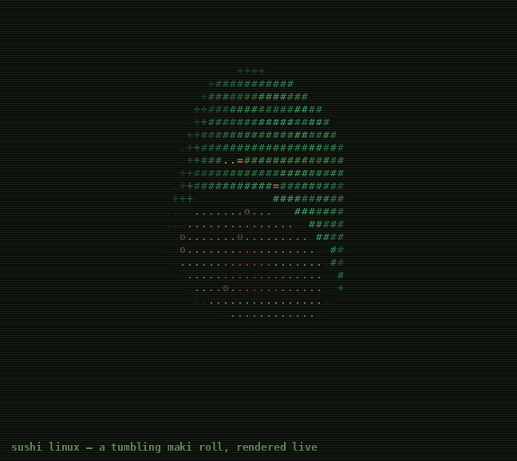

# 🍣 Sushi Linux

> A Linux distro for people who take their rice more seriously than their filesystems.

Sushi Linux is a fork of nothing in particular, wrapped in nori and shipped
with a boot animation nobody asked for. Part of the Food Linux family,
alongside [Linux Mango](#) and [Aanti Linux](#).



*A tumbling maki roll, rendered live — real 3D math (rotate, project,
z-buffer), not a recorded screen capture. See [`sushi.c`](./sushi.c).*

## Features

- 🍣 Boots into a spinning ASCII maki roll instead of a logo
- 🍚 Rice-based init system (systemd, just relabeled)
- 🥢 Package manager accepts chopstick gestures (not really, but it should)
- 🧂 Comes pre-salted

## Quick start

Watch the boot animation without installing anything:

```bash
curl -fsSL https://raw.githubusercontent.com/<you>/sushi-linux/main/boot.sh | sh
```

`boot.sh` compiles [`sushi_donut.c`](./sushi_donut.c) on the fly and runs
it. If you don't have a C compiler on hand, it falls back to a static
ASCII plate instead of just failing.

## Building the boot animation yourself

```bash
cc -O2 -o sushi_donut sushi_donut.c -lm
./sushi_donut
```

Ctrl-C to exit. It's a short cylinder — nori wall, two capped ends, rice
and a filling core by radius — rotated in 3D and painted one character at
a time by a fixed light source, same technique as the classic
[`donut.c`](https://www.a1k0n.net/2011/07/20/donut-math.html), different
shape.

## Repo layout

```
.
├── sushi_donut.c     # the actual ASCII renderer
├── boot.sh           # curl | sh wrapper, self-compiling
├── sushi-donut.gif   # recorded loop, used above
└── README.md
```

## The ASCII sushi, for anyone browsing on a phone

```
       _.-'''''-._
     .'   🍣  🍣   '.
    /   rice bed      \
   |    ______________  |
   |   /______________\ |
    \____________________/
```

---

Built out of spite for boring `neofetch` output. Not affiliated with any
actual sushi.
